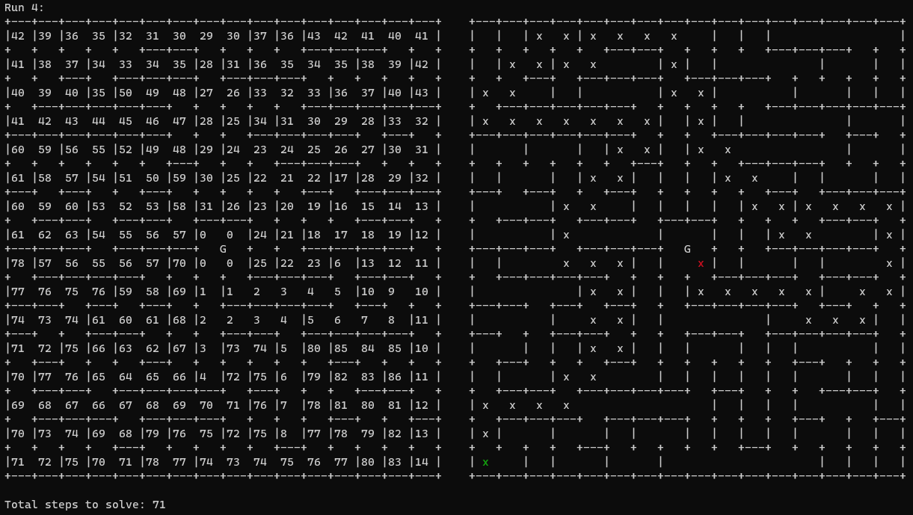

# flood-fill-maze-c - A flood fill maze solving algorithm in C

This algorithm takes an ASCII maze in a text file as input, and simulates a robot solving it using a flood fill algorithm. Results are printed to the console which show the simulated robots path through the maze on each iteration of the flood fill algorithm. Also printed to the terminal on each iteration is a version of the maze with each cell scored according to how many steps away the robot thinks that cell is.

Example Output after 4 iterations:

## Building
Just build main.c with a modern version of [GCC](https://gcc.gnu.org/)

### Windows
Follow [these](https://code.visualstudio.com/docs/cpp/config-mingw#_installing-the-mingww64-toolchain) instructions to install gcc from mingw-64 via MSYS2.

With gcc installed and available on the PATH, open this repo in powershell and compile the `main.c` file with gcc:

    gcc main.c -o flood-fill-maze-c.exe

### Linux
Check if gcc is installed by running "`gcc --version`" in your terminal, if it is not installed, install it via your distro's package manager (e.g. `sudo apt install gcc` for Ubuntu/Debian).

With gcc installed, open this repo in your terminal (i.e. bash), and compile `main.c` with gcc:

    gcc main.c -o flood-fill-maze-c.o

## Running
After building, open a terminal (e.g. powershell or bash) in the folder where your gcc output file is (e.g. flood-fill-maze-c.exe) and run the program:

    ./flood-fill-maze-c.exe (Windows)

                OR

    .flood-fill-maze.c.o (Linux)